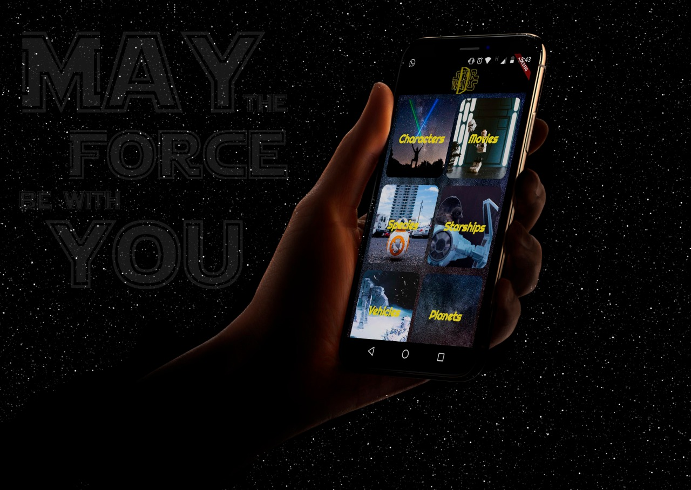

# Using SWAPI with flutter
A little project with Star Wars APi using Dart's framework Flutter. The 6 images used at the menu are property from :
https://unsplash.com/@neonbrand
https://unsplash.com/@tobiasc
https://unsplash.com/@danielkcheung
https://unsplash.com/@eric_ding
https://unsplash.com/@nathananderson
https://unsplash.com/@danieltuttle

API used in this project: http://swapi.co

### Mockup made by https://www.linkedin.com/in/beatriz-dias-borges-4b59a6104/

  

